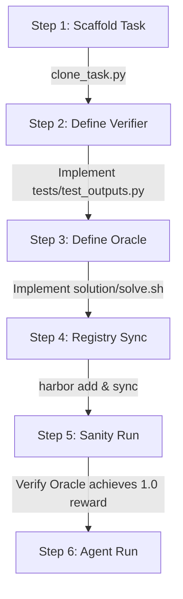

# Harbor — Evaluation Orchestration Guide

Build, debug, and bootstrap Harbor evaluations at scale using **Decoupled System Environments** and the **Oracle verification** workflow.

---

## 1. Core Architecture: Decoupled & Scripted Oracles

To bypass the bottleneck of manually writing complex, brittle solution scripts for each evaluation task, this skill enforces a **Decoupled System Environment** pattern.

Instead of coding custom agent wrappers, we implement:
1. **Automated Verifiers (`tests/`):** Independent test suites built using the `eval_helpers.Evaluator` framework that run inside the container to grade agent outputs.
2. **Scripted Oracles (`solution/`):** A lightweight mock script (`solve.sh` / helper Python scripts) that generates the exact correct outputs. This acts as a sanity check to prove the verifier is correct and provides a "golden" baseline run.



---

## 2. Directory Layout & Standard Format

Every task in the dataset must conform strictly to this folder structure:

```text
tasks/{task_id}/
├── task.toml                  # Execution limits, timeouts, and workspace files configuration
├── instruction.md             # Text prompt / instruction provided to the agent
├── environment/
│   └── Dockerfile             # Custom dependencies (MUST inherit FROM agents-base:latest)
├── solution/
│   ├── solve.sh               # Executable script that runs the oracle solution
│   └── solve_oracle.py        # [Optional] Python script to generate solution files
└── tests/
    ├── test.sh                # Executable verifier entrypoint (runs test runner)
    └── test_outputs.py        # Evaluator python script checking correctness and writing reward
```

### Component Reference Table

| Component | Path | File Format | Operational Purpose |
| :--- | :--- | :--- | :--- |
| **Metadata** | `task.toml` | TOML | Configures task limits, timeouts, and embedded workspace files. |
| **Instruction** | `instruction.md` | Markdown | The explicit, isolated prompt fed directly to the agent's context. |
| **Container** | `environment/Dockerfile` | Dockerfile | Custom task container; inherits from `agents-base:latest`. |
| **Oracle Script** | `solution/solve.sh` | Bash | Scaffolds/runs the solution mock code to produce correct output files. |
| **Verifier Entrypoint**| `tests/test.sh` | Bash | Run by Harbor to trigger tests; wrapper invoking python verifier. |
| **Test assertions** | `tests/test_outputs.py` | Python (`eval_helpers`) | Asserts output correctness, parses structures, runs LLM judges if needed. |

---

## 3. Base Docker Environment Setup

All task Dockerfiles inherit from `agents-base:latest` which is pre-baked with agent runtimes (Hermes), Python verification tools (`google-genai`, `instructor`, `pytest`), and base packages.

### Root Dockerfile (`Dockerfile`)
The base image is built from the root `Dockerfile` at the repository root:

```dockerfile
FROM python:3.11-slim

# Pre-install dependencies to speed up agent initialization
RUN apt-get update && apt-get install -y \
    curl \
    git \
    ripgrep \
    xz-utils \
    && rm -rf /var/lib/apt/lists/*

# Install NousResearch hermes-agent inside the docker image at build time
RUN curl -fsSL https://raw.githubusercontent.com/NousResearch/hermes-agent/main/scripts/install.sh | bash -s -- --skip-setup

# Add hermes to PATH (installed to /root/.local/bin)
ENV PATH="/root/.local/bin:${PATH}"

# Pre-install verifier and agent dependencies
RUN pip install --no-cache-dir \
    google-genai \
    instructor==1.15.1 \
    pydantic>=2.0 \
    jsonref \
    pytest==8.4.1 \
    pytest-json-ctrf==0.3.5

WORKDIR /workspace
```

### Rebuilding the Base Image
If dependencies in the root `Dockerfile` or the local `eval-helpers` package change, rebuild the docker image:
```bash
docker build -t agents-base:latest -f Dockerfile .
```

---

## 4. Step-by-Step Task Bootstrapping Recipe

Follow this protocol to seed and verify a new task:

### Step 1: Scaffold the Task
Initialize the task directory using the task cloning utility script:
```bash
python3 tasks/clone_task.py {task_name}
```
*Note: This clones the template files from the `templates/task_template/` root folder (not in `tasks/`) to ensure the template itself is never ran as a task during dataset evaluation.*

- Verify `tasks/task_{task_name}/task.toml` has `max_tokens = 65365` under the `[agent]` block. This higher limit is required for Gemini models to avoid truncation errors during complex agent runs.
- Edit `tasks/task_{task_name}/instruction.md` to define the agent's task instructions.

### Step 2: Implement the Verifier
1. Define tests and grading logic in `tasks/task_{task_name}/tests/test_outputs.py` using `eval_helpers.Evaluator`:
   ```python
   from pathlib import Path
   from eval_helpers import Evaluator

   def main():
       # Always point Evaluator output_path to /logs/verifier/reward.json
       ev = Evaluator(workspace="/workspace", output_path="/logs/verifier/reward.json")

       # 1. Gate check: Verify file was created (fatal=True stops execution early on failure)
       @ev.criterion("file_created", weight=1.0, fatal=True)
       def check_file_created(workspace: Path) -> bool:
           return ev.file_exists("output.json")

       # 2. Structure check: Use Pydantic to validate data structure
       @ev.criterion("valid_json", weight=1.0)
       def check_valid_json(workspace: Path) -> float:
           try:
               data = ev.load_json("output.json")
               # perform checks...
               return 1.0
           except Exception:
               return 0.0

       ev.run()

   if __name__ == "__main__":
       main()
   ```
2. The verifier entrypoint `tasks/task_{task_name}/tests/test.sh` is a simple shell wrapper:
   ```bash
   #!/bin/bash
   python3 /tests/test_outputs.py
   ```

### Step 3: Implement the Oracle Solution
1. Write a script `tasks/task_{task_name}/solution/solve.sh` that mimics the actions of a perfect agent (e.g., executing a python script to generate files, copying solutions).
2. Verify that executing `solve.sh` writes the expected solution files to `/workspace`.

### Step 4: Register and Sync the Task
Add the task to the manifest `dataset.toml` and generate its content digest:
```bash
# Remember to run git add so git-tracked task files can be hashed
git add tasks/task_{task_name}
./.venv/bin/harbor add hermes-claw/task_{task_name}
./.venv/bin/harbor sync
```

### Step 5: Run the Oracle Sanity Check
Run the task with the `oracle` agent to prove that the verifier correctly scores the oracle solution as `1.0`:
```bash
export GEMINI_API_KEY="..."
./.venv/bin/harbor run -p tasks/task_{task_name} -a oracle \
  --job-name oracle-{task_name} \
  --ae GEMINI_API_KEY='${GEMINI_API_KEY}' \
  --ve GEMINI_API_KEY='${GEMINI_API_KEY}' \
  --ve LITELLM_DROP_PARAMS=True
```
Verify that the output reward is `1.0`.

### Step 6: Run the Agent Trial
Validate the task using the real `hermes` agent with a Gemini model:
```bash
./.venv/bin/harbor run -p tasks/task_{task_name} -a hermes -m gemini/gemini-3.5-flash \
  --job-name hermes-{task_name} \
  --ae GEMINI_API_KEY='${GEMINI_API_KEY}' \
  --ve GEMINI_API_KEY='${GEMINI_API_KEY}' \
  --ve LITELLM_DROP_PARAMS=True
```

---

## 5. Rapid Diagnostic Loop

When an agent fails, follow this pipeline to resolve issues:

1. **Check Job Logs:**
   Open the main job log file:
   `cat jobs/{job_name}/job.log`
2. **Review Trial Results:**
   Check the summary results:
   `cat jobs/{job_name}/{task_id}__{random_suffix}/result.json`
3. **Trace Agent Trajectory:**
   Inspect the exact steps and tool outputs of the agent:
   `cat jobs/{job_name}/{task_id}__{random_suffix}/agent/trajectory.json`
4. **Compare Outputs:**
   Compare the agent's `/workspace` state against the oracle's expected solution.

---

## 6. Best Practices & Design Patterns

Ensure all new tasks conform to these architecture rules:

### A. Normalized Python-Based Verifiers
- **Use `eval_helpers.Evaluator`**: The `Evaluator` handles scoring math, early-exiting on fatal criteria, and writing verifier reward results.
- **Flat `reward.json` Schema**: Harbor's verifier parses `reward.json` into flat float/int values. Nested structures (like `"criteria"` or `"metadata"`) cause parsing errors during Harbor verification. The `Evaluator` dynamically flattens all criteria into the root dictionary of `reward.json` (e.g. `{"reward": 1.0, "file_created": 1.0}`) and writes any extra metadata/criteria details to a separate `metadata.json` file.
- **Explicit Checkers**: Always use explicit checks like `ev.file_exists(...)` and `ev.dir_exists(...)` to keep validations clear and obvious.
- **Pydantic Validation**: Use Pydantic `TypeAdapter` when validating lists of complex dictionary structures to avoid nested dictionary `.get()` calls.
- **Qualitative Checks (LLM Judge)**: If a criterion cannot be verified via exact match or parsing (e.g. essay quality, style rules), invoke the evaluator judge:
  ```python
  @ev.criterion("correct_tone", weight=1.0)
  def check_tone(workspace: Path) -> float:
      text = ev.read_file("essay.txt")
      response = ev.llm_judge(
          text=text,
          instructions="Verify that the text is written in a professional tone and contains no emojis.",
          model="gemini/gemini-1.5-flash"
      )
      return 1.0 if response.passed else 0.0
  ```

### B. Digest Synchronization & Git
- The `./.venv/bin/harbor sync` command calculates task digests based on git-tracked files. Make sure to run `git add tasks/{task_id}` before syncing, or the digest in `dataset.toml` might not be updated.

### C. Standard Agent Configurations
- Always evaluate the agent using `gemini/gemini-3.5-flash` as the default model.
- Always check that `max_tokens` is configured to `65365` under the `[agent]` block in `task.toml` to prevent agent responses from getting truncated.

---

## 7. Trajectory-Based Evaluation

Beyond checking workspace outputs, verifiers can inspect **what the agent actually did** using the ATIF trajectory that hermes writes to `/logs/agent/trajectory.json`. This lets you verify that the agent called specific tools, used correct arguments, or followed a required sequence of steps.

### Loading the Trajectory

`Evaluator.load_trajectory()` parses the trajectory and returns a typed `Trajectory` object, or `None` if the file is missing (e.g. the agent timed out before writing it):

```python
trajectory = ev.load_trajectory()  # reads /logs/agent/trajectory.json
```

Hoist this alongside other pre-fetches at the top of `main()` so it's only parsed once:

```python
def main():
    ev = Evaluator(workspace="/workspace", output_path="/logs/verifier/reward.json")

    content    = ev.read_file("blog_post.md")
    trajectory = ev.load_trajectory()          # ← pre-fetch once
```

### Query Primitives

`Trajectory` exposes three composable primitives that cover all common checks:

| Method | Returns | Use |
|---|---|---|
| `exists(fn, predicate?)` | `bool` | Pass/fail: was a tool called (with matching args)? |
| `find(fn, predicate?)` | `ToolCall \| None` | Retrieve first matching call to inspect its args |
| `find_all(fn, predicate?)` | `list[ToolCall]` | All matching calls, e.g. to count or aggregate |

`predicate` is an optional `lambda tc: bool` applied to each `ToolCall`. Use `tc.arg("key", default)` to safely read arguments.

### Examples

```python
from pathlib import PurePosixPath
from eval_helpers import Evaluator

# -- Was write_file called at all? --
trajectory.exists("write_file")

# -- Was write_file called targeting blog_post.md (any path form)?
# Handles ./blog_post.md, blog_post.md, /workspace/blog_post.md, etc.
trajectory.exists(
    "write_file",
    lambda tc: PurePosixPath(tc.arg("path", "")).name == "blog_post.md",
)

# -- Did a terminal call run pytest? --
trajectory.exists("terminal", lambda tc: "pytest" in tc.arg("command", ""))

# -- Inspect the first write_file call's arguments --
tc = trajectory.find("write_file")
if tc:
    print(tc.arg("path"))      # e.g. "./blog_post.md"
    print(tc.arg("content"))   # full file content

# -- Count how many times the agent read a file --
reads = trajectory.find_all("read_file")
print(f"Agent read {len(reads)} files")
```

### Wiring it into a Criterion

```python
@ev.criterion("wrote_blog_post_md", weight=0.10, fatal=False)
def check_wrote_blog_post_md(workspace: Path) -> float:
    """Verify the agent used write_file to create blog_post.md."""
    if not trajectory:
        print("FAIL: trajectory not found — cannot verify tool calls")
        return 0.0
    if trajectory.exists(
        "write_file",
        lambda tc: PurePosixPath(tc.arg("path", "")).name == "blog_post.md",
    ):
        print("PASS: write_file called with blog_post.md")
        return 1.0
    print("FAIL: no write_file call targeting blog_post.md found")
    return 0.0
```

### Saving Agent Logs as Artifacts

To persist `hermes.txt`, `hermes-session.jsonl`, and `trajectory.json` alongside the workspace snapshot for post-run inspection, add this before `ev.run()`:

```python
import shutil

# Save workspace outputs
ev.save_dir(".")

# Save agent logs (trajectory, raw stdout, structured session)
agent_logs_src = Path("/logs/agent")
agent_logs_dest = ev.artifacts_dir / "agent_logs"
if agent_logs_src.is_dir():
    if agent_logs_dest.exists():
        shutil.rmtree(agent_logs_dest)
    shutil.copytree(agent_logs_src, agent_logs_dest)
```

Artifacts land in `jobs/{job_name}/{trial_id}/verifier/artifacts/agent_logs/`.

> **Note:** The oracle agent does not produce a trajectory (it runs a shell script, not an LLM). Trajectory criteria should use `fatal=False` so they degrade gracefully without blocking oracle sanity runs.

---

## 8. Multi-Container Setups & External Services

For evaluation tasks that require external services (e.g., databases, mock API servers, git servers, or network proxy tools like `fws`), Harbor supports multi-container environments configured via **Docker Compose**.

### Directory Structure
When a task needs external services, replace or supplement the standard `environment/Dockerfile` with a compose setup:
```text
tasks/{task_id}/
├── task.toml
├── environment/
│   ├── Dockerfile             # Custom agent container (the `main` service)
│   ├── Dockerfile.fws         # Dockerfile for the mock/proxy service
│   └── docker-compose.yaml    # Container orchestration spec
...
```

### Docker Compose Schema Guidelines
Your `environment/docker-compose.yaml` must follow these rules:
1. **The `main` service**: This service represents the agent's workspace. It must build using the task's main `Dockerfile` (which inherits from `agents-base:latest`). The agent shell always executes inside the container for the `main` service.
2. **Sidecar services**: Define additional services for mock APIs, databases, or proxy servers.
3. **Startup sequencing**: Use `depends_on` with the `service_healthy` condition on the `main` service to ensure all external dependencies are fully running and initialized before the agent begins.
4. **Volume Sharing**: Use shared volumes (e.g. `fws-certs`) to share assets, certificates, or logs between containers.

### Example: Mocking GitHub APIs via a MitM Proxy (`fws`)
To intercept the agent's HTTPS calls and redirect GitHub API requests to a mock server:

1. **`environment/Dockerfile.fws`**:
   ```dockerfile
   FROM node:20-slim
   RUN apt-get update && apt-get install -y curl && rm -rf /var/lib/apt/lists/*
   WORKDIR /app
   RUN npm install -g @juppytt/fws
   EXPOSE 4100
   EXPOSE 4101
   CMD ["fws", "server", "start", "--foreground"]
   ```

2. **`environment/docker-compose.yaml`**:
   ```yaml
   services:
     main:
       depends_on:
         fws-server:
           condition: service_healthy
       volumes:
         - fws-certs:/certs:ro
       environment:
         - HTTPS_PROXY=http://fws-server:4101
         - HTTP_PROXY=http://fws-server:4101
         - SSL_CERT_FILE=/certs/ca-bundle.crt

     fws-server:
       build:
         context: .
         dockerfile: Dockerfile.fws
       volumes:
         - fws-certs:/root/.local/share/fws/certs
       healthcheck:
         test: ["CMD", "curl", "-f", "http://localhost:4100/__fws/status"]
         interval: 2s
         timeout: 5s
         retries: 15
         start_period: 5s

   volumes:
     fws-certs:
   ```

### Important: Token Passing & Agent Environment Stripping Gotcha
Many agent frameworks (like `hermes-agent`) sanitize/strip environment variables before launching shell tools inside the sandbox. Even if you define variables like `GH_TOKEN=fake` or `GITHUB_TOKEN=fake` in the `docker-compose.yaml` environment block, the agent framework might strip them during its internal runs.

To ensure authentication tokens or keys are successfully passed through the agent's tool execution environment, they must be explicitly configured in the agent environment block in the job configuration or task's `task.toml`:
```toml
# task.toml / job_config.json
[agent.env]
GH_TOKEN = "fake"
GITHUB_TOKEN = "fake"
```